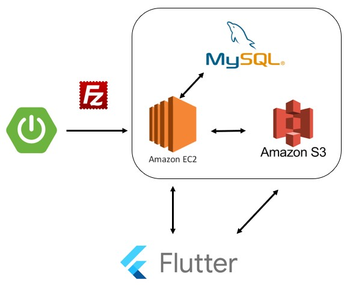
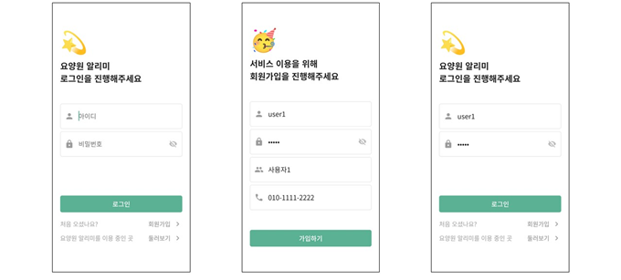
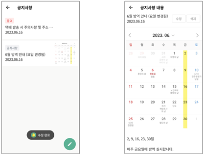
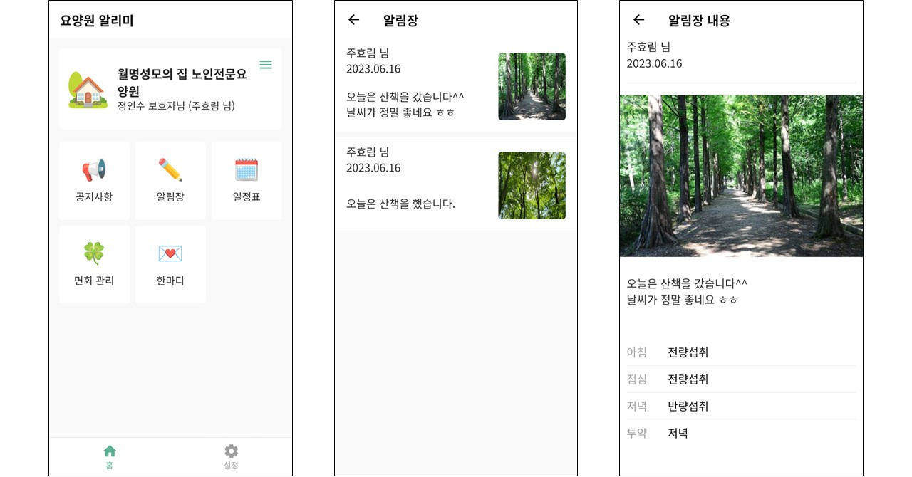
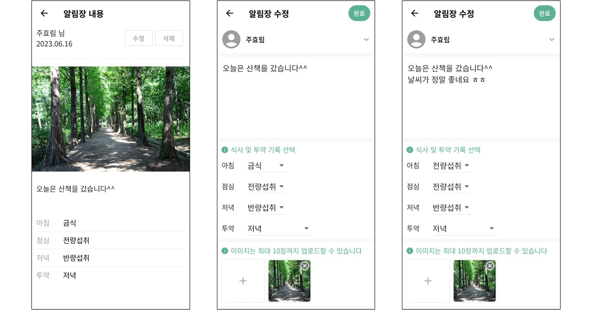
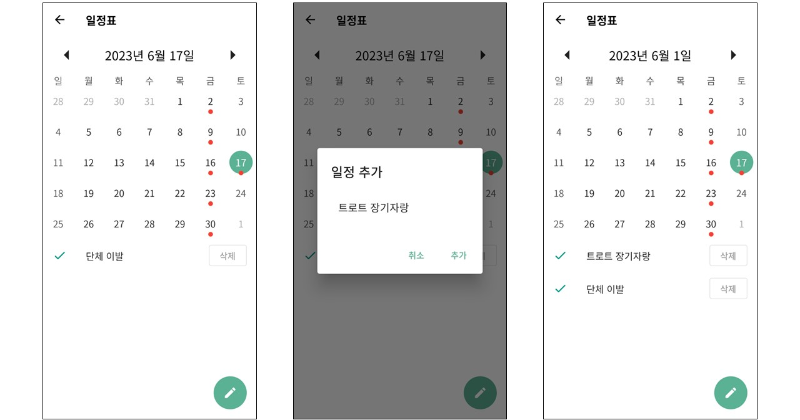
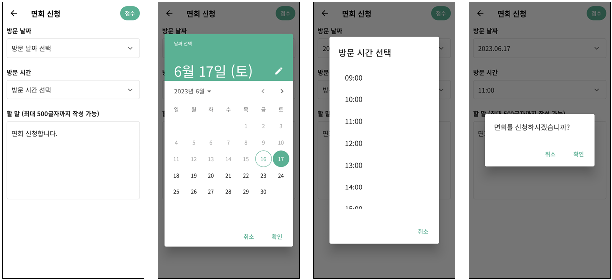
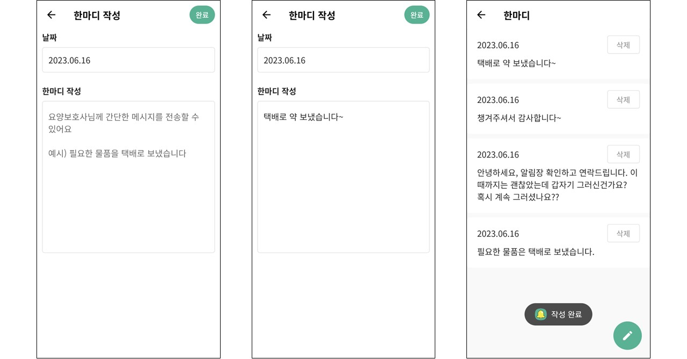
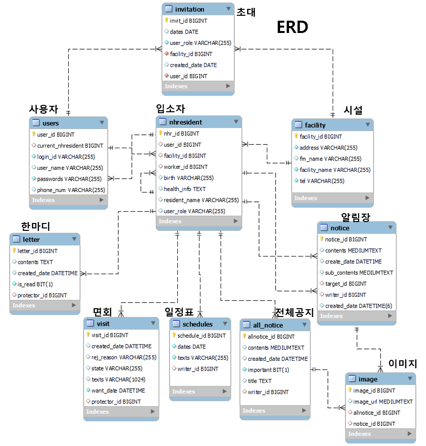

# 요양원 알리미 서비스

## 프로젝트 개요

- 키즈노트, 패밀리노트 어플리케이션을 밴치마킹하여 타겟층을 어르신으로 한 요양원 앱 서비스
- 보호자와 요양보호사를 위한 앱
- 3월 22일 구미 요양원에 직접 방문하여 인터뷰를 진행하였고, 필요한 요구사항을 정리하여 기능에 담음

 

## 프로젝트 구조

 

## 구현 화면

 

 

 

 

 

 

 

 

## ERD

